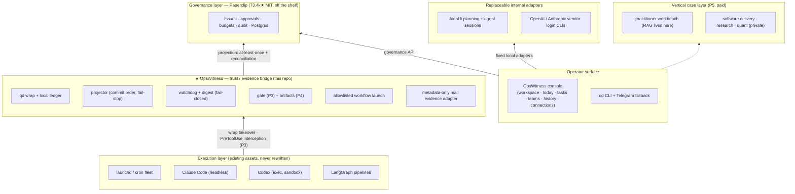

# Architecture

> Run long-lived AI work with approvals, evidence, and recoverable execution.

OpsWitness is the **trust / evidence bridge** in a five-layer stack. It is not the
control plane (that's [Paperclip](https://github.com/paperclipai/paperclip), bought not
built), and not an executor (your launchd jobs and coding agents stay untouched). It also
ships a thin local operator console, but that console delegates rather than becoming a
second control plane. The bridge remains the one layer nothing else can replace: the place
where ungoverned reality gets connected to governance, with the evidence held locally.

## Community Alpha identity and compatibility

`v0.1.0-alpha.1` uses `OpsWitness` for the product and `opswitness` for the distribution,
Python module, repository, and primary CLI. `qd` remains the same CLI entry point through at least
`v0.2.0`. Canonical `OPSWITNESS_*` variables coexist with `QD_*` compatibility aliases; conflicting
values fail closed. Fresh installs use OpsWitness roots and `com.opswitness.*` services. A machine
with only the former roots or `com.quarterdeck.*` services continues in place, while simultaneous
old/new roots or matching services are treated as an operator-visible ambiguity.

Brand migration never rewrites the authority it is supposed to protect. Ledger and lifecycle
events, CAS bytes, plan/artifact hashes, old protocol markers, and historical external identifiers
remain immutable. The former Python import package is intentionally not retained because it was not
publicly released.

The Community Alpha contract covers the local single-operator core. Private HTTPS, device pairing,
and PWA are Beta; Gmail and Telegram are default-off Experimental integrations. Repeatable Work
and auditable Workspace Memory are implemented in source but require a fresh RC artifact and
canary before they enter the published Alpha contract. OpenClaw, Work-as-worker/team-of-teams,
DeepSeek/Grok execution adapters, SaaS, and multi-user identity remain excluded.

## Product position

> **OpsWitness 帮助一人公司把一个想法自动变成可重复的 AI 团队流程，并通过一键运行、版本历史和可验证结果长期经营。**

This is a product-door statement, not a claim that OpsWitness replaces every layer underneath it.
Codex, Claude, AionUi, and other runtimes do the specialist work. OpsWitness owns the reusable Work
contract around them: goal, plan, Agent architecture, runtime assignments, versions, runs, outputs,
attention, and evidence. The local-first console is the one ordinary place where an operator can
describe an outcome, review the proposed task plan and reporting hierarchy, confirm the immutable
plan hash, watch active work, graphically set bounded collaboration loops, make task-bound approval
decisions inline, and read evidence-backed history. The chat-first Workspace remains the default
top-level entry for every session.
The optional Today action view is temporarily hidden from navigation; its summary model remains
available for later restoration, and any legacy Today target resolves to Workspace. Confirmation
never redirects away from the chatbox. Work keeps the
goal, task-scoped team, current activity, immutable run history, outputs, and settings together. System automation history
that has no Work owner is folded into Settings diagnostics. Workspace also projects immutable Plan
revision chains as selectable planning conversation history. It holds three
reusable starting points: common presets, private task templates, and team blueprints. It
distinguishes six proven Work templates inside the common catalog. Those templates carry static
recipe metadata and may start planning from the empty Workspace in one click, while exact-hash review
and confirmation remain mandatory before execution. It
does not create a second team identity for Today: the active-team panel is a read-only projection of
the same plan ids shown in Work, restricted to active states and bounded observation data. All
organization and lifecycle mutations remain under the selected Work item. It
may fork any reviewed plan into a separate top-level Work. The fork copies only the immutable plan,
team, and settings; its source id/hash become part of a new confirmation hash. It never inherits a
run, approval, operator reply, artifact, or outcome state, and it does not use the parent revision
link that collapses ordinary revisions into one Work. It
defaults its product chrome to English, and keeps the optional English/中文 preference browser-local
so language selection cannot mutate plans, hashes, governance state, or evidence. It delegates
planning and execution to AionUi and other replaceable adapters, governance state to Paperclip, and retains
only the evidence boundary locally. Users should not need to routinely operate Paperclip or AionUi
to use OpsWitness; advanced diagnostics may reveal those adapters when troubleshooting requires it.
The default exposure remains loopback. An explicitly configured private HTTPS surface may be used
from Safari or Chrome only after device pairing; this changes the product door, not the internal
adapter boundary. AionUi and Paperclip remain unreachable through OpsWitness's network listener.

Work-level evolution is chat-first without becoming in-place mutation. The Overview adjustment box
accepts natural-language changes to the goal, stages, Agent roles, reporting hierarchy, bounded
loops, cadence, outputs, and checkpoints. Only a ready or ended source may create a revision. The
request binds the source plan id/hash and writes only the instruction hash to the ledger before the
planner creates a new immutable child. The child returns to ordinary review and exact-hash
confirmation; the adjustment path cannot confirm or dispatch it. Active plan versions remain locked.

Completed Work is also the source of the ordinary **Repeatable Work** projection. OpsWitness folds
each immutable Work chain and exposes only its latest ended, intact reviewed version. Selecting it
uses the existing rerun-preparation path to create an unconfirmed child; it never dispatches and it
does not create a second Work authority. Task templates remain objective-only and team blueprints
remain topology-only, while Repeatable Work carries the complete reviewed process.

Workspace planning conversation history is derived from the same immutable `PlanRecord` chains and
does not introduce a transcript database. A row points to the latest intact revision in one root
chain. Opening it restores that exact Plan for review with no planning, confirmation, or execution
side effect. Saving a template from the row requires explicit confirmation and binds the source
Plan id/hash in the template record and append-only event. The reusable payload remains objective
wording only; organization, runtime, approvals, operator replies, artifacts, and run evidence are
not copied.

Workspace planning materials are a separate immutable input channel. The JSON API accepts at most
five allowlisted files, 5 MiB each and 15 MiB in total. OpsWitness decodes them into a private `0700`
material root, publishes each blob read-only, and binds name, media type, size, content SHA-256, and
opaque material id into the Plan hash. The planner receives only bounded text/PDF excerpts plus
metadata; Office files and images remain metadata-only during planning. Before confirmation and
again before execution, OpsWitness opens every blob without following symlinks and rechecks mode,
size, and digest. Aion team execution receives read-only copies and a relative manifest under its
workspace. The ledger stores the count and manifest digest, never file names or bodies. Attached
plans cannot use the allowlisted workflow launcher because that runtime has no material contract.

Workspace Memory is a separate future-context authority, governed by
[ADR-0008](adr/0008-repeatable-work-and-auditable-workspace-memory.md). Obsidian-compatible Markdown
holds immutable process/knowledge versions; ledger events hold candidate, approval,
supersession, revocation, and rollback evidence. New planning receives only a bounded snapshot of
active approved versions. The snapshot hash and version ids become part of new plan identity, and
confirmation revalidates them. Direct vault edits, unapproved candidates, History records, and CAS
artifacts cannot silently influence planning.

The Work overview's live-progress surface is a bounded projection of public adapter telemetry, not a
second workflow state machine. It refreshes the active execution every 2.5 seconds and may expose an
exactly mapped Agent slot, elapsed duration, blocked/slow state, safe tool identifier and status,
response marker, timestamp, and repeated-event count. It never returns tool arguments, tool output,
message bodies, chain-of-thought, or an inferred completion percentage. Until an executor provides a
public verifiable stage primitive, the stage list is the confirmed plan order rather than a progress
claim; outcome status remains owned by artifacts, evals, and sign-off.

The Work **History** surface is a projection of the immutable plan/run chain, not a mutable chat log.
For an ended Aion run, OpsWitness may continue the exact mapped team and conversations as a new
child run. The new child's parent is the current Work leaf, while `continued_from_plan_id` and the
source plan hash bind the operator-selected historical run. The follow-up body crosses only the
local Aion adapter; OpsWitness persists its hash and lifecycle metadata, not the body. A new plan
hash, governance issue, and append-only requested/delivered/dispatched evidence are mandatory before
the child becomes running. Missing identity, active Work, lost un-reconciled delivery, Paperclip
failure, or unsupported workflow execution fails closed with no fallback runtime. Because the Aion
conversation is shared, continuation snapshots accept only activity at or after the child's
`dispatched_at`; prior replies and stage records never count as evidence for the child.

The confirmed plan also snapshots its execution approval mode. New plans and reviewed reruns
default to `automatic`: after exact plan-hash confirmation, every AionUi tool confirmation receives
an evidence-backed, single-use automatic decision. The operator may switch the plan to
`manual_all`, where each execution tool stops for a human decision. Existing
`automatic_safe` records retain their original versioned exact-name read-only allowlist, while
legacy records without a stored mode remain manual. Every automatic decision still has a
Paperclip approval object and local requested/decided/delivered policy evidence. Failure to create,
record, or deliver that decision still blocks the call.

The confirmed plan mode is an immutable initial-policy snapshot. For an active Aion team,
`ExecutionState.approval_mode` is the current policy and Work may change it through an optimistic
compare-and-set API. Tightening to `manual_all` applies immediately. Loosening to `automatic`
requires a separate operator confirmation and applies only to confirmations created afterward;
each approval stores its request-time mode and automatic-decision reason, so an already-paused call
cannot be approved retroactively. The transition writes requested and committed ledger events and
does not rewrite the plan or hash. Startup recovery folds an incomplete transition to the more
restrictive old/new mode.

In `manual_all`, the actionable approval card is exposed only on the Work item whose locally
validated `plan_id` matches the OpsWitness-created Aion approval payload. Approve/reject, the
optional note, and the explicit review acknowledgement remain in that task's attention surface;
the global Approval view is an aggregate queue, not a required navigation hop. A decided card is
removed before the same Work item resumes or presents its next bounded input request.

Active Aion team work uses one fixed-position lifecycle control group in Work: Start/Continue,
Pause, and End. The stable positions make controls discoverable without changing their semantics.
Start/Continue is enabled only after Aion has confirmed `paused`; it never bypasses initial plan/hash
confirmation. Approval/input waits cannot be resumed by the lifecycle control. End retains explicit
second confirmation and remains pending until Aion proves the run inactive or terminal.

When required task data is missing, the running AionUi team may create one bounded
`qd_request_input`. OpsWitness stores the question only in the private plan record and stores its
hash in the append-only ledger. The operator's answer is likewise hash-audited, tagged for
idempotent reconciliation, and sent back to the same confirmed team. This is a resumable input
channel, not a new planner, chat history, or permission to expand the confirmed plan.

The distinction is essential: Paperclip remains the bought control plane, AionUi and vendor CLIs
remain execution adapters, and OpsWitness remains the local trust/evidence bridge plus the simple
operator experience. It does not become a second scheduler, generic workflow engine, agent runtime,
or mutable employee directory.

The product-level simplicity and repeatability contract is defined in
[PRODUCT-VISION.md](PRODUCT-VISION.md). Architecture work must preserve that ordinary flow even
when new adapters are added: Workspace -> review -> confirm -> Work -> History/Results -> Run again,
revise, or fork. Adapter growth must not create new ordinary top-level operating paths.

Reporting lines and iterative collaboration are intentionally different graphs. Direct management
remains one acyclic rooted tree. A collaboration loop may return to a prior agent or the same agent,
but it must carry an explicit stop condition and a 1-10 iteration cap; at most five loops may be
confirmed per plan. Both graphs are hash-bound. Until the execution adapter exposes a verifiable
round counter, the loop cap is a plan-level contract and must not be presented as hard runtime
enforcement.

## The stack

Evidence flows **upward**. Nothing above the bridge is a source of truth.

## Design laws (review-hardened, each has tests)

1. **The local ledger is the sole source of truth.** Append-only JSONL outbox,
   crash-safe write protocol (O_APPEND + flock, one event one write, started fsync'd
   before exec, finished fsync'd before exit, torn-tail heal + quarantine). Paperclip
   receives *projections* — at-least-once with reconciliation, never claimed as
   exactly-once. If Paperclip dies, the evidence chain is intact. See
   [ADR-0001](adr/0001-run-ledger-write-model.md).
2. **Fail closed, everywhere.** No approval decision means no. `automatic` is a snapshotted policy
   that produces a real allow-once decision only after exact plan confirmation; `automatic_safe`
   preserves the older fixed exact-name policy. Both are recorded before delivery, not runtime
   bypasses. Unreachable API means no.
   Unsupported schedule renders red, never silently green. Absence of coverage is
   reported as absence — "no schedules" is never "0 missed"; coverage counts only
   *active* monitoring, over *every* job the ledger has ever seen. Retirement and
   reversal are append-only `job_retired` / `job_unretired` events; any later run
   resurfaces as `resurrected` until an explicit unretire.
3. **Execution evidence ≠ outcome evidence.** Exit codes prove the process ran; they do
   not prove the data was right. The digest says so explicitly; outcome evidence
   (artifact hashes, evals, approvals) arrives with P4 and is labeled separately.
4. **Discovery generates candidates; monitoring requires one human enrollment.**
   Auto-tighten may run unattended (bounded, audited, rollbackable); auto-loosen is
   propose-only, always. Never break the wrapped job: ledger failure degrades to an
   alert, exit codes are mirrored faithfully (including death-by-signal).
5. **Canonical ID = the full launchd label.** Short names are display sugar; an ID that
   could drift when a neighbor appears would sever ledger history. User config is
   strict-schema (scalar enroll rejected, identity fields not overridable).
6. **The platform layer has no LLM, no embeddings, no RAG — deliberately.** Evidence
   does not tolerate "approximately relevant". Structured queries beat vectors here;
   at scale, lexical FTS is the upgrade path. Knowledge retrieval (RAG) belongs to the
   vertical case layer, where the curated rules corpus is itself the paid content —
   shape defined in [ADR-0002](adr/0002-knowledge-layer.md): deterministic-first split,
   markdown vault as source, structured-first retrieval, verifiable citations.
7. **A workflow button is an allowlisted launch, never a remote shell.** OpsWitness owns the
   visible task action; AionUi may execute it as a hidden adapter. OpsWitness accepts only an exact id from a local `0600`
   manifest, then enforces fixed argv, no runtime parameters, single-workflow concurrency,
   a detached supervisor, and fsync-before-exec dispatch order. See
   [ADR-0004](adr/0004-allowlisted-workflow-launch.md).
8. **Mailbox content is untrusted external data.** The hidden planning adapter can invoke only one fixed,
   administrator-owned metadata query. OpsWitness persists `mail_check_requested` before
   access and `mail_check_finished` before returning sender/subject/date/message-id fields;
   neither event stores those fields. No body, draft, send, delete, label mutation, or runtime
   query exists in the CLI or MCP surface. The normal 13-tool MCP excludes mail entirely;
   `qd mcp --profile mail` exposes only status/check, and model transmission additionally
   requires an explicit local consent bit. Before login, the loopback console requires a valid
   Google Desktop OAuth client at gws's fixed location with `0700` directory and `0600` file
   permissions. Import is explicit, schema-validated, canonicalized, and atomically published;
   no client field enters the API response or ledger. The console can obtain the consent bit only
   after two literal-true acknowledgements and an exact readonly Gmail OAuth flow; activation
   lives in a private managed file so user configuration is never rewritten. See
   [ADR-0005](adr/0005-metadata-only-mail-monitor.md).
9. **Elapsed rollout gates are ledger contracts, not prose timestamps.** `qd soak` freezes
   each tracked job's interval/grace and recomputes first/intermediate/trailing cadence gaps,
   terminal/degraded evidence, schedule drift, torn lines, and projection backlog. A hard
   failure remains failed until a reasoned append-only reset; checkpoints never become a
   second truth source. See [ADR-0006](adr/0006-append-only-soak-gates.md).
10. **Planning and execution are separate state transitions.** New general work is drafted
    by an ephemeral AionUi team in Plan Mode, without tools. OpsWitness validates the strict
    plan schema and records only request/plan hashes in the ledger. A Paperclip issue and an
    AionUi execution team or allowlisted workflow can be created only after a human confirms
    the exact plan hash. Plan modification is append-only: a child version binds the immutable
    parent hash and a hashed change instruction, shows a structural diff, and requires a fresh
    confirmation; it never edits the reviewed parent in place. User-facing deletion is likewise
    append-only: one `task_plan_deleted` tombstone hides an inert plan while its private record and
    evidence remain intact. Active work cannot be deleted, and version parents require child-first
    deletion. Task adjustments are chat-first: an operator describes the intended change, including
    a bounded collaboration-loop change, and OpsWitness creates a fresh plan revision for review.
    The Team tab inside the unified Work view folds each plan into one acyclic reporting tree and a separate set of
    bounded collaboration loops; its direct editor is an explicit advanced path for precise manual
    edits. Organization edits create hash-bound child versions and pass the effective hierarchy plus
    loop contracts to Paperclip governance and AionUi execution;
    OpsWitness stores no second employee directory. The current AionUi adapter has no verifiable
    round-limit primitive, so these loops are plan-level constraints rather than runtime proof.
    Completion remains `completed_unverified` until outcome evidence exists. A runtime or model
    change is a structured child-plan revision: every Agent's runtime and model id are validated
    against sanitized local capability state, receive a fresh plan hash, and cannot silently
    downgrade or fall back at execution time. Exact ids, rolling aliases, and the runtime default
    remain visibly distinct. Execution profiles are only a deterministic review-time resolver over
    that catalog: new plans use `balanced`, reruns default to `fast`, and `deep` is opt-in. Applying
    a profile resolves every Agent to one advertised model id and creates a new immutable child plan;
    direct per-Agent edits create `custom`. No profile is consulted during dispatch, so the runtime
    cannot silently change a confirmed model. Profiles express latency/quality preference, not a
    wall-clock SLA. Runtime control follows the same evidence-first rule. For Aion team
    executions, OpsWitness fsyncs pause/resume/cancel requests before calling the public adapter
    API. Pause is accepted only after all active slots report paused; resume binds a fixed marker
    to the same confirmed plan; cancel remains requested until the exact run is observed inactive
    or terminal. These controls are not shown for workflow adapters that cannot prove equivalent
    transitions. A reusable team blueprint is a private, versioned planning input containing only
    role topology, reporting edges, collaboration edges, and runtime preference. It is manually
    saved from a non-active task, never creates an employee directory, and is never automatically
    enabled or overwritten. The UI may show only adapter-observable member states such as activity
    observed, response observed, unobserved, or unavailable; those signals never prove a business
    outcome. See
    [ADR-0007](adr/0007-local-operator-console.md).
11. **Notification setup is narrow, local, and evidence-first.** The console is not a generic
    secret editor. It accepts only Telegram token/chat ID into password fields, writes through the
    existing `0600` secret boundary, serializes configuration changes, and exposes only a fixed
    test message behind a separate confirmation. Credentials never enter ledger events or API
    responses; environment-managed values cannot be replaced from the UI.
12. **OpsWitness is the only ordinary product door.** Provider login, task planning, approval
    decisions, and evidence review stay in the loopback console. AionUi and Paperclip are named
    only in advanced diagnostics and remain replaceable adapters. Vendor credentials stay with
    vendor-owned CLI login flows; OpsWitness receives only sanitized status.

## Necessity and shrinkability

OpsWitness exists because of three verified gaps, no more:

| Gap | Verified how |
|---|---|
| Nothing monitors *external* scheduled scripts | Paperclip's watchdog verifies only its own issue trees (official docs) |
| No tool-call-level, fail-closed approval gate | paperclip#3017 open, unassigned, zero PRs; hobby hooks have no ledger |
| No content-hashed artifacts; platform records are self-reported | work-products carry no hashes; audit-chain bug open upstream |

It is designed to **shrink**: ADR-0001 carries revisit triggers — if upstream ships an
external-run API, tool gates, or content hashes, the corresponding module retires.
A thin layer that refuses to thin itself becomes the thing it replaced.

**The wheel test** — every proposed module must first answer: does Paperclip, Claude
Code, or launchd already do this? Applied consequences: the gate (P3) builds no policy
engine and no in-hook waiting (Claude Code's native permission pipeline handles static
allow/deny/ask; its `permissionDecision: "defer"` handles the pending-decision
lifecycle — we add only the defer→Paperclip-approval→resume bridge and the ledger
record); artifacts (P4) build no database (authority = one ledger event kind; the
projection rides Paperclip work-products with reconciliation, since `externalId` has
no unique constraint upstream); vertical-case agents (P5) run natively as Paperclip
agents/routines. Scheduling stays with launchd (launchd intervals are elapsed-time,
cron is calendar-aligned — they are not translatable); the approval **workflow state** stays with
Paperclip while the visible decision UI and **authoritative approval evidence**
(request hash, tool_use_id, expiry, approval id, decision, decider, resume/consume
outcome) stay in OpsWitness and the local ledger — law 1 admits no exception: if Paperclip loses its
database, pending calls stay denied and every past decision remains locally auditable;
sessions stay with the agent CLIs. Version 1 records the local single-user actor as
`local_console`; it does not claim multi-user or remote identity assurance.

AionUi's native Manual Scheduled Task remains an advanced adapter test surface, not an operator
requirement. OpsWitness builds no DAG editor or workflow runtime. Its local console is the one
composition surface for daily operations, approvals, connections, and new-task plan review; confirmed execution is
delegated to AionUi teams or to fixed asynchronous MCP launches whose requested/dispatched/run
events share one run id. Internal workflow orchestration stays with the registered command (for
example LangGraph).

The standalone Paperclip MCP is deliberately not mounted in AionUi. Its pinned
v2026.707.0 surface includes approval decisions, other mutations, and a general `/api`
escape hatch, with no documented read-only mode or scoped read-only token. Prompt-level
instructions are not an authorization boundary. OpsWitness therefore exposes only a fixed
approve/reject facade over the Paperclip API and keeps the general Paperclip MCP unavailable to
the model. On the pinned loopback-only `local_trusted` deployment, that facade verifies the health
deployment mode and uses Paperclip's implicit local board actor only for the fixed decision call;
ordinary projection calls retain the service-agent token. AionUi receives OpsWitness's
evidence-oriented MCP surface.

## Entry doctrine: OpsWitness is the door

Two kinds of doors, two opposite rules:

**Platform layer (open source): spine plus one thin local door.** `opswitness` and the ledger remain
the operational spine. The local console is the ordinary first-use experience for a one-person
company: create a reusable Work, confirm it, operate it, then run it again or evolve it without
rebuilding the process. It owns no scheduler, agent runtime, model chat surface, or DAG;
each dependency stays replaceable because the console calls versioned local adapters instead of
absorbing their state machines. The CLI and Telegram remain fallbacks, not competing setup paths.

**Commercial layer (paid verticals): the door IS the product.** Entry equals
relationship ownership — whoever's surface opens every morning owns the brand memory,
the pricing conversation, and the renewal. Paid users enter through a **purpose-built
thin workbench** (for the practitioner case: client list → chart → draft → sign-off
queue → delivery), never through a generic issue board, and never via "install three
tools and wire up MCP". Not a rebranded Paperclip fork — that buys the UI maintenance
debt of a 73k★ project and still ships the wrong UX; the workbench calls the lower
layers' APIs and Paperclip stays as invisible as Postgres. It stays thin (weeks, not
months) precisely because every piece of logic lives below: the deterministic engine,
Paperclip-native agents, the gate, the corpus MCP.

Sequencing: the generic local operator console may evolve with the open platform. The
purpose-built practitioner workbench remains blocked until a paying pilot exists.
Paperclip's per-company `branding:update` can carry practitioner branding without a fork;
paid users ultimately see the vertical workbench, not the generic operations surface.

## Module map

| Module | Path | Status |
|---|---|---|
| ledger (outbox + write protocol) | `src/opswitness/ledger.py`, `fsutil.py` | ✅ P2 |
| wrap runner (tee, bounded process-tree signals, mirroring) | `src/opswitness/wrap/runner.py`, `process_tree.py` | ✅ P2 |
| projector (issues/comments, reconciliation) | `src/opswitness/projector.py`, `paperclip.py` | ✅ P2 |
| index (disposable SQLite) | `src/opswitness/index.py` | ✅ P2 |
| watchdog / digest / coverage | `src/opswitness/watchdog.py`, `digest.py`, `schedules.py` | ✅ P2 |
| job lifecycle | `src/opswitness/lifecycle.py` | ✅ P2 |
| canary / soak evidence gate | `src/opswitness/soak.py` | ✅ append-only contract + CLI |
| bootstrap (candidates, two-file model) | `src/opswitness/bootstrap.py` | ✅ P2 |
| adopt (dry-run plist wrapping) | `src/opswitness/adopt.py` | ✅ P2 (`--apply` gated on install) |
| MCP console surface | `src/opswitness/mcp_server.py` | ✅ 13-tool ops (including safe package metadata and bounded operator input) + isolated 2-tool mail profile |
| allowlisted workflow launcher | `src/opswitness/workflows.py`, `workflow_worker.py` | ✅ code + tests + live AionUi one-click acceptance |
| metadata-only mail monitor | `src/opswitness/mail.py`, `console/`, `console-ui/` | ✅ adapter + setup/revoke UI; live OAuth and AionUi schedule pending |
| repeatable Work + Workspace Memory | `src/opswitness/console/service.py`, `store.py`, `console-ui/src/workspace-memory-dialog.tsx` | ✅ source + tests: ended-Work projection, review-first preparation, Obsidian-compatible immutable versions, approval/revoke/rollback, approved planning snapshot; fresh RC/canary pending |
| Workspace conversation history | `src/opswitness/console/service.py`, `schemas.py`, `console-ui/src/App.tsx` | ✅ source + tests: immutable Plan-chain projection, exact latest-version restore, provenance-bound objective template, zero execution side effect; fresh RC/canary pending |
| Workspace planning materials | `src/opswitness/console/service.py`, `schemas.py`, `aionui.py`, `console-ui/src/App.tsx` | ✅ source + tests: bounded upload, immutable Plan-hash binding, private read-only storage, tamper rejection, bounded planner excerpts, and hash-verified Aion execution copies; fresh RC/canary pending |
| local operator console | `src/opswitness/console/`, `console-ui/` | ✅ sole operator surface + default Workspace chatbox with planning history/presets/templates/blueprints + optional Today + unified Work details + immutable runtime revisions + independent hash-bound Work forks + evidence-only member observation, bounded live activity, and plan-bound AionUi team-task stage telemetry + evidence-first Aion pause/continue/terminate controls + provider account/Console login, one-time OpenAI CLI stdin handoff, Anthropic Keychain + apiKeyHelper, DeepSeek/xAI Keychain connections, official Grok account flow, and fixed-loopback Ollama/LM Studio discovery plus hidden AionUi registration + planning/progress + graphical hierarchy/bounded loops + ledger-folded run history + approval facade + Gmail/Telegram + responsive UI; real run-control acceptance, DeepSeek/Grok execution adapters, local-model live acceptance, and production canary remain pending |
| install doctor / secure services / disaster recovery | `src/opswitness/doctor.py`, `service.py`, `backup.py` | ✅ five secret-free templates + installed-command drift check; soak pending |
| gate (PreToolUse `defer` → Paperclip approval → resume) | `gate.py`, `gated_claude.py` | ✅ M3 code + two live approval/resume drills |
| artifacts (ledger events + content-addressed projection) | `artifacts.py`, `index.py` | ✅ M4 code + live projection |
| vertical case packs | separate private repo | P5 |

Status tracks code + tests in this repo. [READINESS.md](READINESS.md) is the single
current release-gate snapshot; ADRs remain the design authority.

Related: [P0 validation](P0-VALIDATION.md) · [readiness gates](READINESS.md) ·
[approved install runbook](INSTALL-PAPERCLIP.md) ·
[AionUi console setup](aionui.md) ·
[commercialization strategy](COMMERCIALIZATION.md)
