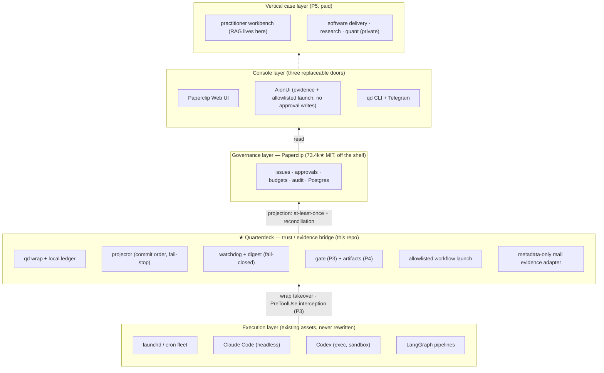

# Architecture

> Run long-lived AI work with approvals, evidence, and recoverable execution.

Quarterdeck is the **trust / evidence bridge** in a five-layer stack. It is not the
control plane (that's [Paperclip](https://github.com/paperclipai/paperclip), bought not
built), not an executor (your launchd jobs and coding agents stay untouched), and not a
UI (three doors already exist). It is the one layer nothing else can replace: the place
where ungoverned reality gets connected to governance, with the evidence held locally.

## The stack

Evidence flows **upward**. Nothing above the bridge is a source of truth.

## Design laws (review-hardened, each has tests)

1. **The local ledger is the sole source of truth.** Append-only JSONL outbox,
   crash-safe write protocol (O_APPEND + flock, one event one write, started fsync'd
   before exec, finished fsync'd before exit, torn-tail heal + quarantine). Paperclip
   receives *projections* — at-least-once with reconciliation, never claimed as
   exactly-once. If Paperclip dies, the evidence chain is intact. See
   [ADR-0001](adr/0001-run-ledger-write-model.md).
2. **Fail closed, everywhere.** No approval decision means no. Unreachable API means no.
   Unsupported schedule renders red, never silently green. Absence of coverage is
   reported as absence — "no schedules" is never "0 missed"; coverage counts only
   *active* monitoring, over *every* job the ledger has ever seen. Retirement and
   reversal are append-only `job_retired` / `job_unretired` events; any later run
   resurfaces as `resurrected` until an explicit unretire.
3. **Execution evidence ≠ outcome evidence.** Exit codes prove the process ran; they do
   not prove the data was right. The digest says so explicitly; outcome evidence
   (artifact hashes, evals, approvals) arrives with P4 and is labeled separately.
4. **Discovery generates candidates; monitoring requires one human enrollment.**
   Auto-tighten may run unattended (bounded, audited, rollbackable); auto-loosen is
   propose-only, always. Never break the wrapped job: ledger failure degrades to an
   alert, exit codes are mirrored faithfully (including death-by-signal).
5. **Canonical ID = the full launchd label.** Short names are display sugar; an ID that
   could drift when a neighbor appears would sever ledger history. User config is
   strict-schema (scalar enroll rejected, identity fields not overridable).
6. **The platform layer has no LLM, no embeddings, no RAG — deliberately.** Evidence
   does not tolerate "approximately relevant". Structured queries beat vectors here;
   at scale, lexical FTS is the upgrade path. Knowledge retrieval (RAG) belongs to the
   vertical case layer, where the curated rules corpus is itself the paid content —
   shape defined in [ADR-0002](adr/0002-knowledge-layer.md): deterministic-first split,
   markdown vault as source, structured-first retrieval, verifiable citations.
7. **A workflow button is an allowlisted launch, never a remote shell.** AionUi owns the
   Manual Task and **Run now** UI. Quarterdeck accepts only an exact id from a local `0600`
   manifest, then enforces fixed argv, no runtime parameters, single-workflow concurrency,
   a detached supervisor, and fsync-before-exec dispatch order. See
   [ADR-0004](adr/0004-allowlisted-workflow-launch.md).
8. **Mailbox content is untrusted external data.** AionUi can invoke only one fixed,
   administrator-owned metadata query. Quarterdeck persists `mail_check_requested` before
   access and `mail_check_finished` before returning sender/subject/date/message-id fields;
   neither event stores those fields. No body, draft, send, delete, label mutation, or runtime
   query exists in the CLI or MCP surface. The normal 11-tool MCP excludes mail entirely;
   `qd mcp --profile mail` exposes only status/check, and model transmission additionally
   requires an explicit local consent bit. See
   [ADR-0005](adr/0005-metadata-only-mail-monitor.md).
9. **Elapsed rollout gates are ledger contracts, not prose timestamps.** `qd soak` freezes
   each tracked job's interval/grace and recomputes first/intermediate/trailing cadence gaps,
   terminal/degraded evidence, schedule drift, torn lines, and projection backlog. A hard
   failure remains failed until a reasoned append-only reset; checkpoints never become a
   second truth source. See [ADR-0006](adr/0006-append-only-soak-gates.md).

## Necessity and shrinkability

Quarterdeck exists because of three verified gaps, no more:

| Gap | Verified how |
|---|---|
| Nothing monitors *external* scheduled scripts | Paperclip's watchdog verifies only its own issue trees (official docs) |
| No tool-call-level, fail-closed approval gate | paperclip#3017 open, unassigned, zero PRs; hobby hooks have no ledger |
| No content-hashed artifacts; platform records are self-reported | work-products carry no hashes; audit-chain bug open upstream |

It is designed to **shrink**: ADR-0001 carries revisit triggers — if upstream ships an
external-run API, tool gates, or content hashes, the corresponding module retires.
A thin layer that refuses to thin itself becomes the thing it replaced.

**The wheel test** — every proposed module must first answer: does Paperclip, Claude
Code, or launchd already do this? Applied consequences: the gate (P3) builds no policy
engine and no in-hook waiting (Claude Code's native permission pipeline handles static
allow/deny/ask; its `permissionDecision: "defer"` handles the pending-decision
lifecycle — we add only the defer→Paperclip-approval→resume bridge and the ledger
record); artifacts (P4) build no database (authority = one ledger event kind; the
projection rides Paperclip work-products with reconciliation, since `externalId` has
no unique constraint upstream); vertical-case agents (P5) run natively as Paperclip
agents/routines. Scheduling stays with launchd (launchd intervals are elapsed-time,
cron is calendar-aligned — they are not translatable); the approval **workflow, UI and
human identity** stay with Paperclip while the **authoritative approval evidence**
(request hash, tool_use_id, expiry, approval id, decision, decider, resume/consume
outcome) stays in the local ledger — law 1 admits no exception: if Paperclip loses its
database, pending calls stay denied and every past decision remains locally auditable;
sessions stay with the agent CLIs.

AionUi's native Manual Scheduled Task already owns the button, history, and **Run now** action.
Quarterdeck therefore builds no workflow UI and no DAG runtime. It contributes only the missing
security/evidence adapter: fixed local definitions become asynchronous MCP launches whose
requested/dispatched/run events share one run id. Internal workflow orchestration stays with the
registered command (for example LangGraph).

The standalone Paperclip MCP is deliberately not mounted in AionUi. Its pinned
v2026.707.0 surface includes approval decisions, other mutations, and a general `/api`
escape hatch, with no documented read-only mode or scoped read-only token. Prompt-level
instructions are not an authorization boundary. Paperclip Web UI therefore remains the
only approval-decision door; AionUi receives Quarterdeck's evidence-oriented MCP surface.

## Entry doctrine: the platform doesn't fight for the door; the product must BE the door

Two kinds of doors, two opposite rules:

**Platform layer (open source, power users): spine, not door.** Quarterdeck is the
operational entry (`qd` is the only command; the MCP server is what consoles talk to)
and never grows its own GUI. Doors are replaceable — Paperclip's board for governance,
AionUi for conversation, Telegram for the daily pulse — and any of them can be swapped
without touching the spine. Product value concentrates in the irreplaceable layer
precisely because it doesn't compete for this doorway.

**Commercial layer (paid verticals): the door IS the product.** Entry equals
relationship ownership — whoever's surface opens every morning owns the brand memory,
the pricing conversation, and the renewal. Paid users enter through a **purpose-built
thin workbench** (for the practitioner case: client list → chart → draft → sign-off
queue → delivery), never through a generic issue board, and never via "install three
tools and wire up MCP". Not a rebranded Paperclip fork — that buys the UI maintenance
debt of a 73k★ project and still ships the wrong UX; the workbench calls the lower
layers' APIs and Paperclip stays as invisible as Postgres. It stays thin (weeks, not
months) precisely because every piece of logic lives below: the deterministic engine,
Paperclip-native agents, the gate, the corpus MCP.

Sequencing: not one line of UI code until a paying pilot exists. Interim for pilots:
Paperclip's per-company `branding:update` carries our/practitioner branding without a
fork, and the first touch is already ours (`qd init`, signed corpus bundles). Paid
users still never see Quarterdeck itself — they see the workbench it makes trustworthy.

## Module map

| Module | Path | Status |
|---|---|---|
| ledger (outbox + write protocol) | `src/quarterdeck/ledger.py`, `fsutil.py` | ✅ P2 |
| wrap runner (tee, bounded process-tree signals, mirroring) | `src/quarterdeck/wrap/runner.py`, `process_tree.py` | ✅ P2 |
| projector (issues/comments, reconciliation) | `src/quarterdeck/projector.py`, `paperclip.py` | ✅ P2 |
| index (disposable SQLite) | `src/quarterdeck/index.py` | ✅ P2 |
| watchdog / digest / coverage | `src/quarterdeck/watchdog.py`, `digest.py`, `schedules.py` | ✅ P2 |
| job lifecycle | `src/quarterdeck/lifecycle.py` | ✅ P2 |
| canary / soak evidence gate | `src/quarterdeck/soak.py` | ✅ append-only contract + CLI |
| bootstrap (candidates, two-file model) | `src/quarterdeck/bootstrap.py` | ✅ P2 |
| adopt (dry-run plist wrapping) | `src/quarterdeck/adopt.py` | ✅ P2 (`--apply` gated on install) |
| MCP console surface | `src/quarterdeck/mcp_server.py` | ✅ 11-tool ops + isolated 2-tool mail profile |
| allowlisted workflow launcher | `src/quarterdeck/workflows.py`, `workflow_worker.py` | ✅ code + tests; live AionUi task pending |
| metadata-only mail monitor | `src/quarterdeck/mail.py` | ✅ code + tests; OAuth and AionUi schedule pending |
| install doctor / secure services / disaster recovery | `src/quarterdeck/doctor.py`, `service.py`, `backup.py` | ✅ M1 + M2 live validation; soak pending |
| gate (PreToolUse `defer` → Paperclip approval → resume) | `gate.py`, `gated_claude.py` | M3 code complete; live auth/acceptance pending |
| artifacts (ledger events + content-addressed projection) | `artifacts.py`, `index.py` | ✅ M4 code + live projection |
| vertical case packs | separate private repo | P5 |

Status tracks code + tests in this repo. [READINESS.md](READINESS.md) is the single
current release-gate snapshot; ADRs remain the design authority.

Related: [P0 validation](P0-VALIDATION.md) · [readiness gates](READINESS.md) ·
[approved install runbook](INSTALL-PAPERCLIP.md) ·
[AionUi console setup](aionui.md)
